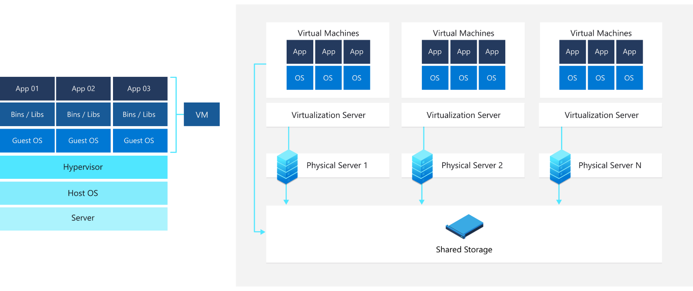

# Question 1

> Explain Working mechanism of Virtual Machine.

Virtual Machine (VM) is a software used virtualization of an application environment to work as a computer system. They are used to imitate as a computer inside another computer.  VM creates an isolated environment to run its own OS and application independent on the underlining host system. While our computers are made up of physical parts, VM are thought of software defined virtual computers.

Computers that host the VMs uses special software called Hypervisors. Hypervisor emulates the computer's CPU, memory, hard disk, network and other hardware resources, creating a pool of resources that can be allocated to the individual VMs according to their specific requirements. It also schedules operations in VMs so they don’t overrun each other when using resources

There are two types of hypervisors:
- **Type 1.** Type 1 or bare-metal hypervisor, this type of hypervisor runs directly on the physical host machine and has direct access to its hardware. Type 1 hypervisors typically run-on server computers and are considered more efficient and better-performing than Type 2 hypervisors, making them well suited to server, desktop and application virtualization. Examples of Type 1 hypervisors include Microsoft Hyper-V and VMware ESXi.
 
)

- **Type 2.** Type2 or hosted hypervisor, is installed on top of the host machine's OS, which manages calls to the hardware resources. Type 2 hypervisors are generally deployed on end-user systems for specific use cases. For example, a developer might use a Type 2 hypervisor to create a specific environment for building an application, or a data analyst might use it to test an application in an isolated environment. Examples of Type 2 hypervisors include VMware Workstation and Oracle VirtualBox.

