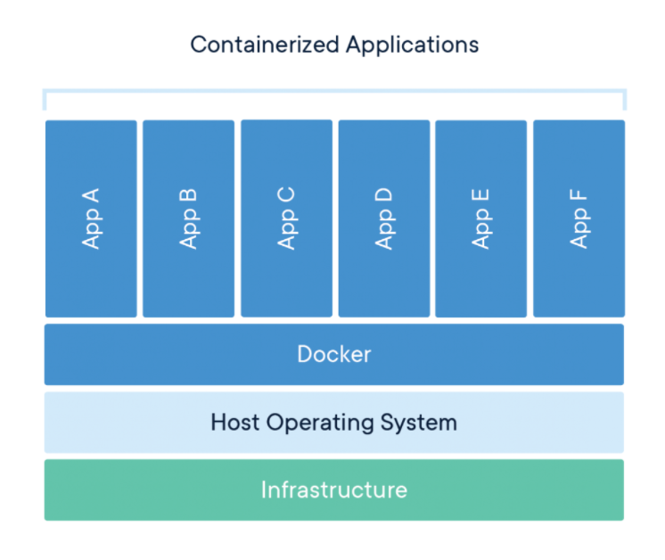
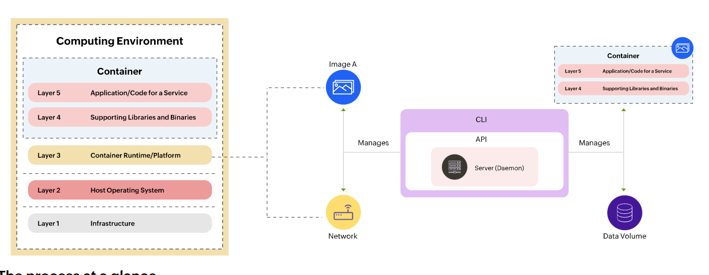

# Question 2

> Explain Working mechanism of Containers.

Containers directly comes from the concept of shipping containers, where each containers create its own environment for what’s inside it. Containers allow applications to be deployed reliably and migrated quickly between various computing environments by packaging code, configuration settings, and dependencies into a single object. 
The concept of containers is similar to that of virtual machines. The differentiating factor is that VMs virtualize at the hardware level and containers virtualize at the operating system level.  The containerization approach creates a more lightweight and flexible environment by allowing applications to share an operating system while maintaining their own executables, code, libraries, tools, and configuration files.

A sample application, or a microservice, is packaged into a container image and deployed for use through the container platform. The container platform is a client-server software facilitating the execution of the container by providing three key operational components:
1.	A daemon is a process that runs in the background. This daemon manages objects like images, containers, and other communication (network), and storage (data volume) objects needed by the microservice encapsulated within the container.
2.	An application programming interface (API) allows programs to interact with and direct the daemon process.
3.	A command line interface (CLI) client issues commands, like "pull" and "run", and is used to access container images from a configured registry. The command line uses the API to control or interact with the daemon through direct commands, or scripts containing commands. The daemon, in turn, delivers the results through the Host OS System for further processing, or as a final output.

